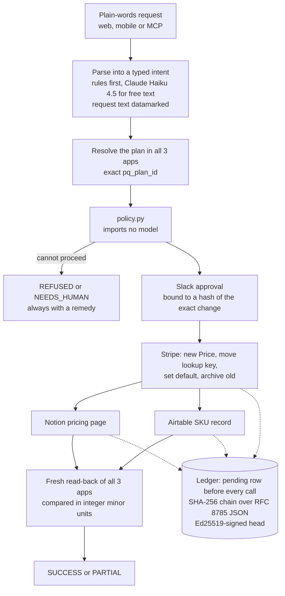

# PriceQuorum

**One price change, written once to Stripe, Notion and Airtable, approved by a person in Slack, and proven by reading all three apps back.**

[](https://github.com/StephenSook/pricequorum/actions/workflows/backend.yml)
[](https://github.com/StephenSook/pricequorum/actions/workflows/web.yml)
[](https://github.com/StephenSook/pricequorum/actions/workflows/deployed-smoke.yml)
[](https://github.com/StephenSook/pricequorum/actions/workflows/mobile.yml)

| | |
|---|---|
| **Demo video (91 s)** | https://pricequorum-web.vercel.app/demo/PriceQuorum_Demo.mp4 |
| **Live web app** | https://pricequorum-web.vercel.app |
| **Judge tour** | https://pricequorum-web.vercel.app/judges |
| **Break it yourself** | https://pricequorum-web.vercel.app/break |
| **Check the ledger in your browser** | https://pricequorum-web.vercel.app/verify |
| **Backend health** | https://pricequorum-api.onrender.com/api/health |
| **Android** | [pricequorum-android.apk](https://github.com/StephenSook/pricequorum/releases/tag/v1.0.0) (signed) |
| **iOS** | TestFlight build 2. The public link https://testflight.apple.com/join/7HthxaHv opens once Apple's beta review approves it. |

Built for the Multi-App AI Agent Hackathon (Lemma x Comma Capital), September 13, 2026.

---

## Try it in three minutes

1. **Watch the video** (91 s): https://pricequorum-web.vercel.app/demo/PriceQuorum_Demo.mp4
2. **Open the judge tour:** https://pricequorum-web.vercel.app/judges. Each stop is marked live only after the backend actually answers.
3. **Ask the backend what it is running and what it can reach:**
   ```
   curl -s https://pricequorum-api.onrender.com/api/health
   ```
4. **Get the ledger's public signing key**, then recompute the whole hash chain in your own browser at `/verify`:
   ```
   curl -s https://pricequorum-api.onrender.com/api/public-key
   ```
5. **Talk to the agent from any MCP client.** The MCP server is live over Streamable HTTP:
   ```
   curl -s https://pricequorum-api.onrender.com/mcp/ \
     -H 'Content-Type: application/json' \
     -H 'Accept: application/json, text/event-stream' \
     -d '{"jsonrpc":"2.0","id":1,"method":"initialize","params":{"protocolVersion":"2025-06-18","capabilities":{},"clientInfo":{"name":"judge","version":"0"}}}'
   ```

The free backend host sleeps when idle, so the first request can take up to a minute.

## What is live today

We would rather show an empty number than an invented one. This is the exact state at submission.

| Piece | State |
|---|---|
| Web app (Vercel) | Live. Every route is loaded in a real browser on desktop and phone on every push and every 30 minutes. |
| Backend API and Postgres (Render) | Live. `/api/health` returns the deployed commit and `"db": "ok"`. |
| MCP server | Live at `/mcp/` with four tools. |
| Mobile | iOS build in TestFlight internal testing; signed Android APK on release v1.0.0. |
| Stripe, Notion, Airtable and Slack adapters | Built and tested against test doubles in CI. **The vendor credentials were not connected to the deployed backend before the deadline**, so no run has touched the real accounts yet. `/api/health` names each app as not configured. |
| Eval results against the real apps | **Not run yet.** `/api/proof` reports 0 of 0 scenarios instead of a made-up pass rate. |

---

## 1. Project overview

### The problem

Stripe does not let you edit a price. Its documentation: *"After you create a price, you can only update its metadata, nickname, and active fields."* So a single price change is a four-step migration inside Stripe (create a new Price, move the lookup key to it, make it the product default, archive the old one), and then the public pricing page in Notion and the SKU catalogue in Airtable have to follow. Nearly four in five SaaS companies change pricing at least once a year (OpenView survey of 2,200 SaaS companies). Miss one system and a customer gets quoted the wrong number.

A normal agent makes this worse: it calls three APIs, gets three `200 OK`s, and reports success, even when a call timed out after it landed, a record was locked, or text inside a Notion page told it to set the price to zero.

### What PriceQuorum does

You type the change in plain words ("Raise the Pro plan to $25 a month") from the web app, the phone app, or any MCP client.



**The model proposes, the code decides.** Rules catch the known request shapes first; Claude Haiku 4.5 turns free text into a typed intent. Every rule that can refuse a change lives in [`backend/pricequorum/policy.py`](backend/pricequorum/policy.py), which imports no model, so nothing a model reads can talk its way past a rule.

Every run ends in exactly one outcome, and every non-success carries a remedy a person can act on:

| Outcome | Meaning |
|---|---|
| `SUCCESS` | A fresh read of Stripe, Notion and Airtable all show the new price. |
| `PARTIAL` | Stripe changed but a derived app did not; the run names which one. |
| `REFUSED` | A rule, a lock or a person stopped the change before anything was written. |
| `NEEDS_HUMAN` | The agent cannot decide safely (for example, two products claim the same plan). |

### Why this design

- **Read back instead of trusting a 200.** A timeout after commit is indistinguishable from a failure unless you look. Every write is followed by a fresh read, and SUCCESS is computed only from those reads.
- **Pending row before the call.** The ledger records intent before each external write, with a deterministic idempotency key `pq:{plan}:{version}:{step}`, so a crash or retry can find what already landed instead of writing it twice.
- **Stripe is the source of truth.** Notion and Airtable follow Stripe and never the other way, so there is one answer to "what is the price".
- **Integers only for money.** Amounts are compared in minor units, so `24.999999999999996` in Notion reads as 2500, not as a divergence.
- **Proof a stranger can check.** The ledger is a SHA-256 hash chain over RFC 8785 canonical JSON with an Ed25519-signed head. `/verify` recomputes it in your browser and does not use the server's verdict.

## 2. External apps used

| App | What PriceQuorum does with it | Code |
|---|---|---|
| **Stripe** (test mode only; a live key is refused at startup) | Authoritative billing. Creates the new Price with `transfer_lookup_key`, sets it as the product's `default_price`, archives the old Price with `active: false`. Every write carries an `Idempotency-Key`. | [`stripe_adapter.py`](backend/pricequorum/adapters/stripe_adapter.py) |
| **Notion** (API `2025-09-03`, data sources) | Public pricing page. Queries the data source, checks the `Locked` checkbox and currency, updates the price, reads it back. | [`notion_adapter.py`](backend/pricequorum/adapters/notion_adapter.py) |
| **Airtable** | SKU catalogue. Updates the one known record through the single-record endpoint (it cannot create a duplicate), checks `Locked`, `pq_plan_id` and currency first, waits the 30 s Airtable asks for after a 429. | [`airtable_adapter.py`](backend/pricequorum/adapters/airtable_adapter.py) |
| **Slack** (Socket Mode) | Human approval gate before any write, bound to a hash of the exact change, with a time limit. | [`slack_approval.py`](backend/pricequorum/adapters/slack_approval.py) |
| **Anthropic Claude** | Turns a free-text request into a typed intent. It never decides whether a change is allowed. | [`intent.py`](backend/pricequorum/intent.py) |

All vendor calls sit behind one seam, [`backend/pricequorum/ports.py`](backend/pricequorum/ports.py), so the run loop never imports a vendor SDK and tests can swap in doubles.

## 3. Setup

Requirements: Python 3.12 with [uv](https://docs.astral.sh/uv/), Node 22, a Postgres database, and test-mode accounts for Stripe, Notion, Airtable and Slack.

**1. Configure.** Copy `.env.example` to `backend/.env` and fill in the names it lists (Stripe test key, Notion token and data source, Airtable token, base and table, Slack bot and app tokens, Anthropic key, `DATABASE_URL`). Never commit real values.

**2. Backend.**
```
cd backend
uv sync
uv run python scripts/seed.py         # creates the demo plans in Stripe, Notion and Airtable; safe to run twice
uv run python scripts/live_check.py   # read-only check of every vendor connection
uv run uvicorn pricequorum.api.app:app --reload
```
Without credentials the API still starts, and `/api/health` names each app that is not configured. `scripts/reset.py` returns the demo plans to their seed prices.

**3. Web.**
```
cd web
npm ci
NEXT_PUBLIC_API_BASE_URL=http://localhost:8000 npm run dev
```

**4. Mobile (optional).**
```
cd mobile
npm ci
npm run start     # Expo; set the backend address in the app's Settings
```

**5. Evals against a running backend.**
```
cd backend
uv run python evals/run_evals.py --help
```

**Deploy.** [`backend/render.yaml`](backend/render.yaml) describes the Render web service (Docker) and Postgres; the web app deploys to Vercel from `web/`.

## 4. Reliability testing

### Every failure we designed for, and the test that proves it

These tests run in CI on every push, against a real Postgres, with test doubles for the vendor APIs ([`backend/tests/fakes.py`](backend/tests/fakes.py), never imported by the app).

| Failure | What PriceQuorum does | Proven by |
|---|---|---|
| Stripe times out **after** the price was created | Reads Stripe back by idempotency key and never creates a second price | `test_timeout_after_commit_reads_back_and_never_writes_twice` |
| A create that never landed | Retries it, and does not adopt some other price with the same amount | `test_a_create_that_never_landed_is_retried_instead_of_adopting_a_same_amount_price` |
| Notion or Airtable write does not land | Ends `PARTIAL` and names the app | `test_a_derived_write_that_never_lands_is_partial_and_named` |
| Record is locked | `REFUSED` before anything is written, remedy names the flag | `test_a_locked_record_is_refused_before_anything_is_written` |
| Two runs on the same plan at once | Exactly one writes; the other is refused cleanly (Postgres advisory lock per plan and currency) | `test_concurrent_runs_let_exactly_one_write`, `test_a_second_run_on_a_locked_plan_is_refused_cleanly` |
| Text inside an app tells the agent to set the price to 0 | `REFUSED` without a write | `test_prompt_injection_is_refused_without_a_write` |
| The approver says no | `REFUSED`, nothing written | `test_an_operator_denial_refuses_the_change` |
| Nobody answers the approval | The approval expires; nothing is written | `test_an_approval_nobody_gives_expires` |
| The same change is requested again | Writes nothing | `test_repeating_a_completed_change_writes_nothing` |
| The process dies mid-run | On restart, runs a previous process left open are closed out from their pending ledger rows instead of hanging | `test_recovery_ends_runs_a_previous_process_left_open` |
| Someone edits a ledger entry | Verification names the edited entry (on a copy; the real ledger is untouched) | `test_chain_tamper_detects_the_change_on_a_copy_and_leaves_the_ledger_alone` |
| Notion or Airtable drifts from Stripe later | Drift monitor detects it and heals it through the ledger | `test_drift_is_detected_healed_through_the_ledger_and_confirmed` |
| A request that cannot proceed | Always ends with a remedy, never a bare error | `test_requests_that_cannot_proceed_end_with_a_remedy` |

### The checks

| Layer | What runs | Result |
|---|---|---|
| Backend | `ruff format --check`, `ruff check`, `mypy`, `pytest` against Postgres, OpenAPI contract check ([`backend.yml`](.github/workflows/backend.yml)) | 169 tests pass |
| Adapters | Stripe, Notion, Airtable and Slack adapter tests, money conversion and fault injection ([`backend/tests/adapters/`](backend/tests/adapters/)) | Included above |
| Web | Contract drift check against the backend's OpenAPI, typecheck, lint, unit tests, production build ([`web.yml`](.github/workflows/web.yml)) | 81 unit tests pass |
| Deployed site | Waits until the live build is the pushed commit, then loads every route on desktop and phone and fails on any console error, failed asset or serious axe (WCAG 2.1 AA) violation ([`deployed-smoke.yml`](.github/workflows/deployed-smoke.yml)) | Green |
| Ledger | The browser verifier is tested against hashes computed independently with Python's `hashlib` | Pass |
| Mobile | Shared run and ledger logic checked for drift against `web/` ([`mobile.yml`](.github/workflows/mobile.yml)) | Green |

### The scenario suite

[`backend/evals/scenarios/`](backend/evals/scenarios/) holds 20 scenario files, one per failure the spec names. Each states the request, any injected fault, the expected outcome and the expected end state in integer minor units. A test asserts all 20 load and that each is either runnable or says why not.

- **15 runnable through the API:** happy path, timeout after commit, Airtable 429, Stripe idempotency 409, repeated change, locked record, prompt injection, edit-in-place request, ambiguous plan name, two currencies, Pro vs Pro Plus kept apart, float precision, concurrent runs, approval denied, chain tamper.
- **5 that state in the file why the API cannot run them yet:** approval expiry (30 minute TTL), half-landed write, stale read, archived price still referenced, subscription migration.

Faults are injected **after** the real request is sent ([`faults.py`](backend/pricequorum/adapters/faults.py)), which models the dangerous case: the write may have landed but the caller never heard back. Every injected fault is labelled `injected` in the run events.

The live harness ([`backend/evals/run_evals.py`](backend/evals/run_evals.py)) runs the scenarios against a deployed backend and fresh vendor reads, grades them from recorded events and reads (never model text), and posts results that `/api/proof` recomputes with a Wilson 95% interval. **It has not been run against the real apps yet**, because the vendor credentials were not connected in time.

### Break it yourself

`/break` runs seven sandbox scenarios against an isolated `judge_pro` plan that can never be a demo plan: a normal change, timeout after Stripe accepts, instructions hidden in a Notion record, a locked Airtable record, an edited ledger entry, two changes at once, and drift. The sandbox is rate limited, and it reports itself unavailable until the vendor apps are connected.

## 5. Demo video

**91 seconds:** https://pricequorum-web.vercel.app/demo/PriceQuorum_Demo.mp4

Narrated in Stephen's own voice (his ElevenLabs voice clone), with two on-camera clips of Stephen made with a HeyGen avatar. The screens are captures of the deployed site and real App Store Connect and CI states; the opening text cards explain the problem. Every spoken line is captioned.

---

## API

| Route | Purpose |
|---|---|
| `GET /api/health` | Deployed commit, database, and which vendor apps are configured |
| `POST /api/runs`, `GET /api/runs/{id}`, `GET /api/runs/{id}/events` | Start a run and follow it live over Server-Sent Events with replay |
| `POST /api/runs/{id}/approval` | Operator approval fallback (token required), same resume path as Slack |
| `GET /api/ledger/export`, `POST /api/ledger/verify`, `GET /api/public-key` | The signed ledger |
| `GET /api/proof`, `GET /api/evals/latest` | Eval results recomputed from the database |
| `POST /api/sandbox/runs`, `GET /api/sandbox/status` | Judge sandbox |
| `GET /api/monitor/events`, `POST /api/monitor/heal` | Drift monitor for Notion and Airtable against Stripe |
| `/mcp/` | MCP server: `run_price_change`, `get_run`, `verify_chain`, `get_proof` |

## Web pages

| Route | What it does |
|---|---|
| `/` | Type a price change and follow the run chapter by chapter, each animation driven by a real backend event |
| `/runs/[id]` | The receipt for one run, rebuilt from its recorded events |
| `/verify` | Recomputes the ledger hash chain and checks the head signature in your browser |
| `/evals` | Pass rate with interval, refusals, duplicate writes prevented, named failures |
| `/break` | Trigger a sandbox scenario built to go wrong in one specific way |
| `/judges` | A short tour that marks each stop live only after the backend answers |

## Safety

- Stripe **test mode only**: a live or restricted live key is rejected when the settings load.
- No change is written without a person's approval, and the approval is bound to a hash of the exact change.
- Request text is datamarked before it reaches the model, and the model never decides whether a change is allowed.
- Secrets never enter git: `.env.example` holds names only.
- The judge sandbox is rate limited and confined to its own plan.

## What we would do next

1. Connect the four vendor accounts to the deployed backend and run all 15 runnable scenarios against them, publishing the pass rate and every named failure on `/evals`.
2. Add API support for the 5 scenarios that cannot run yet (verify-only runs, a short approval TTL for tests, subscription migration on a Stripe test clock).
3. Open the TestFlight link once Apple's review completes.

## Repository

| Path | Contents |
|---|---|
| [`backend/`](backend/) | FastAPI service, adapters, ledger, verifier, evals, MCP server ([backend/README.md](backend/README.md)) |
| [`web/`](web/) | Next.js 16 app (App Router, Tailwind 4, GSAP) |
| [`mobile/`](mobile/) | Expo app for iOS and Android, sharing run and ledger logic with `web/` |
| [`docs/contracts/api.md`](docs/contracts/api.md) | API and event-stream contract |
| [`docs/fact-sheet.md`](docs/fact-sheet.md) | The only source for numbers used in the video and README |
| [`PLAN.md`](PLAN.md) | Task status and ownership |

## Team

Stephen Sookra ([@StephenSook](https://github.com/StephenSook)), Tylin Delaney ([@tylinndd](https://github.com/tylinndd)), Khadim Drame ([@khadimswe](https://github.com/khadimswe)).

License: MIT.
